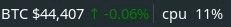

# crypto info for i3status bar

## Demo



## How to use

1. Build an application
```sh
make build
```

2. Configure `i3status` e.g `/etc/i3status.conf`

```
general {
    markup = "pango"
}

order += "read_file binance"

read_file binance {
  path = "/home/user/.binance"
}
```

3. Add the following line to your `~/.i3/config`.
```
exec --no-startup-id /path/to/crypto-info
```